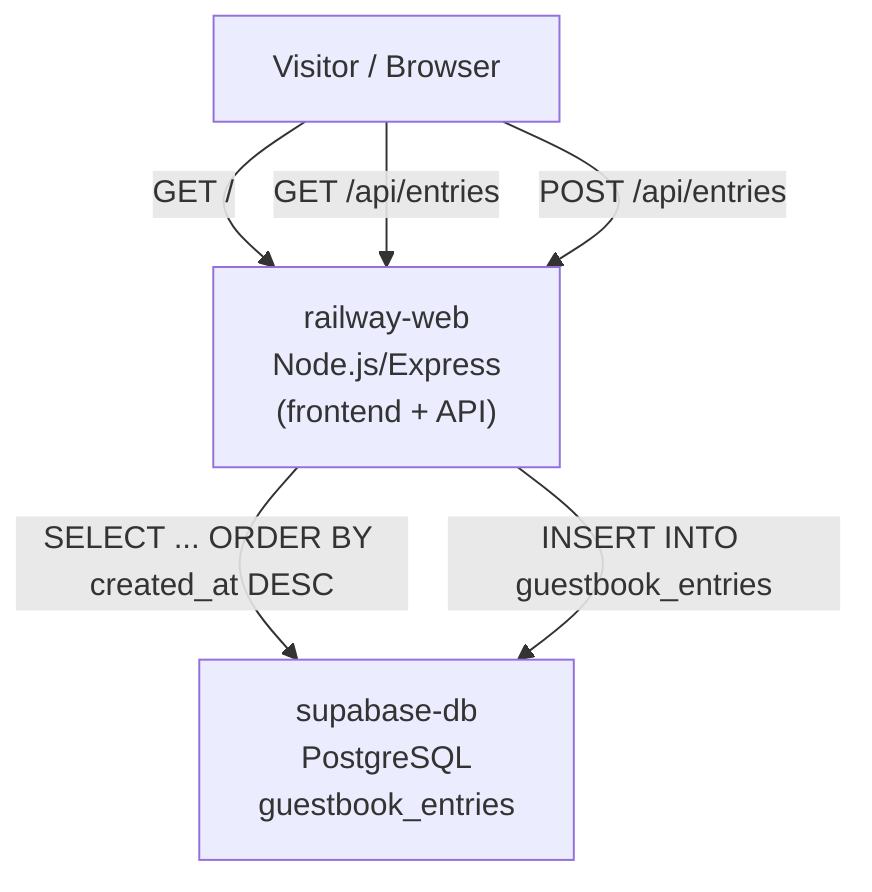

# Architecture: Guestbook Web App

## Overview

A single-page guestbook web application. Visitors read and write entries with zero authentication.
The architecture follows the **fewest services possible** principle: one backend service serves both
the static HTML/CSS/JS frontend and the REST API, backed by a Supabase PostgreSQL database.

## Services

| # | Service | Platform | Role |
|---|---|---|---|
| 1 | `railway-web` | Railway | Node.js/Express app — serves frontend static assets and API endpoints |
| 2 | `supabase-db` | Supabase | PostgreSQL database — persists guestbook entries |

### Service Details

**`railway-web` (Railway)**
- Serves the single-page frontend (`index.html`, `styles.css`, `app.js`) from a `public/` directory.
- Exposes REST API for entries:
  - `GET /api/entries` – returns all entries sorted `created_at DESC`
  - `POST /api/entries` – creates a new entry after validation
- A `GET /` catches all routes so the SPA is served directly at the root domain.
- Deployed via Railway with normal Node.js user-code provision — nothing special required.

**`supabase-db` (Supabase)**
- Single-table PostgreSQL schema.
- No row-level security policies required because all data is public.
- Supabase MCP can provision the project and credentials automatically; the build agent
  receives `SUPABASE_URL` and `SUPABASE_SERVICE_ROLE_KEY` from the environment.

## Data Model

### Table: `guestbook_entries`

| Column | Type | Constraints | Notes |
|---|---|---|---|
| `id` | `uuid` | PK, default `gen_random_uuid()` | Unique identifier |
| `name` | `varchar(100)` | NOT NULL | Visitor's name |
| `message` | `varchar(500)` | NOT NULL | Visitor's message |
| `created_at` | `timestamptz` | NOT NULL, default `now()` | Submission timestamp |
| `honeypot` | `varchar(50)` | – | Hidden anti-spam field (empty on valid submissions) |
| `ip_hash` | `varchar(64)` | – | SHA-256 hash of client IP for rate limiting |

#### Indexes
- `idx_guestbook_entries_created_at DESC` – supports the default sort order

### API Contract

#### `GET /api/entries`

Response `200 OK`:
```json
{
  "entries": [
    {
      "id": "...",
      "name": "Alice",
      "message": "Hello world!",
      "created_at": "2025-01-15T09:30:00Z"
    }
  ]
}
```

#### `POST /api/entries`

Body:
```json
{
  "name": "Alice",
  "message": "Hello world!",
  "honeypot": ""
}
```

Validation:
- `name`: required, 1–100 characters
- `message`: required, 1–500 characters
- `honeypot`: must be empty (reject if non-empty as spam)
- Rate limit: max 3 submissions per hour per IP hash

Response `201 Created`:
```json
{
  "id": "...",
  "name": "Alice",
  "message": "Hello world!",
  "created_at": "2025-01-15T09:30:00Z"
}
```

Response `400 Bad Request`:
```json
{
  "error": "Validation failed",
  "details": ["Name is required", "Message exceeds 500 characters"]
}
```

Response `429 Too Many Requests`:
```json
{
  "error": "Rate limit exceeded. Try again later."
}
```

## Dependency List

| Name | Version | Purpose |
|---|---|---|
| `express` | `^4.19.2` | Web server and routing |
| `@supabase/supabase-js` | `^2.44.0` | Supabase client for PostgreSQL |
| `crypto` | built-in | SHA-256 IP hashing for rate limiting |
| `dotenv` | `^16.4.5` | Environment variable loading (dev) |

Development dependencies:
| Name | Version | Purpose |
|---|---|---|
| `nodemon` | `^3.1.4` | Auto-restart in development |
| `jest` | `^29.7.0` | Test framework (optional) |

## Required Tokens

> Operator must supply:
> - **None** — this app uses no third-party APIs.
> - `SUPABASE_URL` and `SUPABASE_SERVICE_ROLE_KEY` are provisioned automatically by the Supabase MCP
>   during deployment; the Stage 3 build agent reads them from environment variables.
> - No `OPENROUTER_API_KEY` is required because the app contains no LLM/AI features.

## Deployment

1. **Supabase** (`supabase-db`): Build agent uses Supabase MCP to create a project and
define the `guestbook_entries` table and index above.
2. **Railway** (`railway-web`): Build agent uses Railway MCP to create a Node.js service,
set environment variables (`SUPABASE_URL`, `SUPABASE_SERVICE_ROLE_KEY`), and deploy
from the repository root.
3. **Frontend**: Static files are bundled into the Railway service (`public/` directory),
so no separate Vercel frontend is required. Vercel is listed as "if needed" in the
constraints, and for this minimal monolith it is not needed.

## Decisions & Trade-offs

| Decision | Rationale |
|---|---|
| Single Express backend vs Frontend-only (Next.js on Vercel) | Fewer total services (1 compute). Railway Express serves both frontend and API, reducing complexity. |
| Supabase PostgreSQL vs JSON file (per PRD) | Railway containers are ephemeral — a JSON file would be lost on restart. Supabase provides persistent, managed PostgreSQL with agent-provisionable setup. |
| No authentication | Matches PRD "no sign-up or authentication barriers." |
| No ORM | Single table, three queries. Plain SQL via `supabase-js` is less boilerplate than an ORM. |
| Honeypot field vs CAPTCHA | No external API key required. Simple and invisible to real users. |
| Rate limiting without Redis | SQLite-backed in-memory rate limiter using IP hash + timestamp. Acceptable at low traffic (< 100 req/s). |

## Mermaid Diagram


